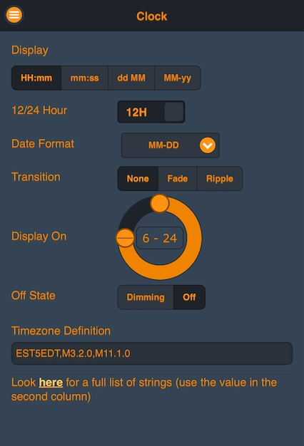

# TimeFliesBridge
This project creates a web interface that can be used to control the [Time Flies Nixie clock](https://www.kickstarter.com/projects/lasermad/time-flies-levitating-nixie-clock) by lasermad. The clock is configured by sending commands using Classic BT serial (aka BTSPP). This presents several issues. The first is that you need a device that supports this BT profile and it needs to be in range of the clock. The second is that you have to master the set of arcane commands.

I initially tried to implement this using one ESP32, but I couldn't get it to stay up reliably using bothe WiFI and BT SPP, so in the end I implemented it using a couple of ESP32 D1 Minis. These are just stacked one on top of the other and housed in a little box. One runs the [BT SPP server](https://github.com/judge2005/SPPServer) (the clock being the client), the other runs the web GUI. The two talk to each other using regular serial and a small set of AT commands.

The benefits are:

1. A modern GUI to control the clock
2. Synchronize time with NTP, so the 'GPS Mouse' isn't necessary but can still be used
3. POSIX style timezone config
4. Automatic DST switching
5. Push all settings after power has been interrupted
6. Set up periods of the day when the display is turned off or dimmed
7. Control multiple LEDs at once

## Screenshots
This shows the main screen:

This shows the LED controls:

This shows additional features:

1. Send an aribtrary command to the clock
2. Push all the settings to the clock
3. Push the time to the clock
4. Display the most recent activity

